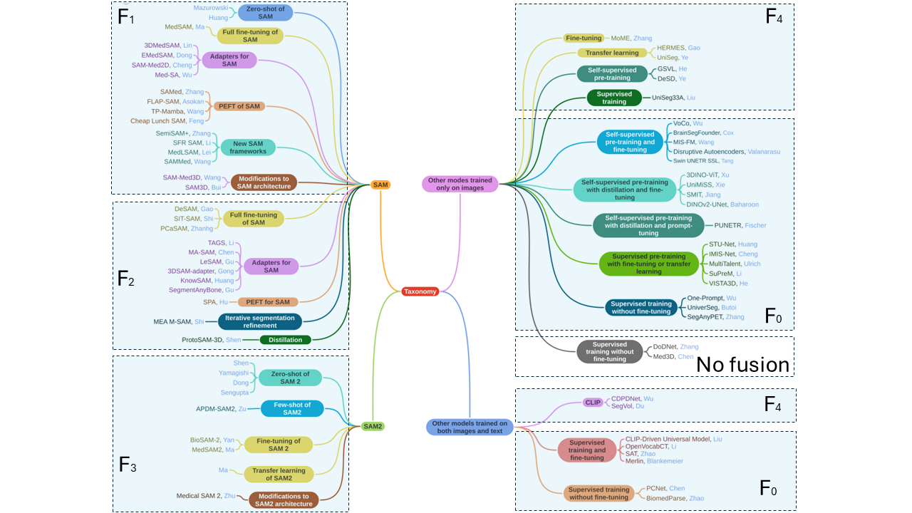

# Generalist Models in Medical Image Segmentation: A Survey and Performance Comparison with Task-Specific Approaches



## List of studies on SAM leveraging F_1 fusion

| Model | Publication | Fine-tuning | Code |
|-------|-------------|----------------|------|
|---| [Segment anything model for medical images?](https://www.sciencedirect.com/science/article/pii/S1361841523003213) | --- | [Code](https://github.com/yuhoo0302/Segment-Anything-Model-for-Medical-Images)|
|---| [Segment anything model for medical image analysis: An experimental study](https://www.sciencedirect.com/science/article/pii/S1361841523001780?via%3Dihub)| --- | [Code](https://github.com/mazurowski-lab/segment-anything-medical-evaluation)|
| MedSAM | [Segment Anything in Medical Images](https://arxiv.org/abs/2304.12306)| Full fine-tuning of SAM | [Code](https://github.com/bowang-lab/MedSAM)|
| 3DMedSAM | [Volumetric medical image segmentation via fully 3D adaptation of Segment Anything Model](https://www.sciencedirect.com/science/article/pii/S0208521624000846?via%3Dihub)| Adapters | --- |
| EMedSAM | [An efficient segment anything model for the segmentation of medical images](https://www.nature.com/articles/s41598-024-70288-8)| Adapters | --- |
| SAM-Med2D | [SAM-Med2D](https://arxiv.org/abs/2308.16184)| Adapters | [Code](https://github.com/OpenGVLab/SAM-Med2D)|
| Med-SA | [Medical SAM Adapter: Adapting Segment Anything Model for Medical Image Segmentation]( https://arxiv.org/abs/2304.12620)| Adapters | [Code](https://github.com/SuperMedIntel/Medical-SAM-Adapter)|


| FLAP-SAM | [A Federated Learning-Friendly Approach for Parameter-Efficient Fine-Tuning of SAM in 3D Segmentation](https://link.springer.com/chapter/10.1007/978-3-031-77610-6_21)| LoRA | [Code](https://github.com/BioMedIA-MBZUAI/FLAP-SAM)|
| TP Mamba | [Tri-Plane Mamba: Efficiently Adapting Segment Anything Model for 3D Medical Images](https://link.springer.com/chapter/10.1007/978-3-031-72114-4_61)| LoRA | [Code](https://github.com/xmed-lab/TP-Mamba)|
| Cheap Lunch SAM | [Cheap Lunch for Medical Image Segmentation by Fine-tuning SAM on Few Exemplars](https://arxiv.org/abs/2308.14133)| LoRA | --- |
| SAMed | [Customized Segment Anything Model for Medical Image Segmentation](https://arxiv.org/abs/2304.13785)| LoRA | [Code](https://github.com/hitachinsk/SAMed)|

## List of new SAM architectures and frameworks based on SAM, leveraging F_1 fusion
| Model | Publication | Application | Code |
|-------|-------------|----------------|------|
| SAM-Med3D | [SAM-Med3D: Towards General-purpose Segmentation Models for Volumetric Medical Images](https://arxiv.org/abs/2310.15161)| Design of 3D SAM architecture | [Code](https://github.com/uni-medical/SAM-Med3D)|
| SAM3D | [SAM3D: Segment Anything Model in Volumetric Medical Images](https://arxiv.org/abs/2309.03493)| Design of 3D SAM mask decoder | [Code](https://github.com/UARK-AICV/SAM3D)|
| SemiSAM+ | [SemiSAM+: Rethinking semi-supervised medical image segmentation in the era of foundation model]( https://www.sciencedirect.com/science/article/pii/S1361841525002804)| Semi-supervised learning framework combining Med-SAM3D and U-Net| [Code](https://github.com/YichiZhang98/SemiSAM)|
| SFR SAM | [Stitching, Fine-tuning, Re-training: A SAM-enabled Framework for Semi-supervised 3D Medical Image Segmentation](https://arxiv.org/abs/2403.11229)| Semi-supervised learning framework based on SAM | [Code](https://github.com/ShumengLI/SFR)|
| MedLSAM | [MedLSAM: Localize and Segment Anything Model for 3D CT Images](https://arxiv.org/abs/2306.14752)| Integration od SAM with a foundation model for localization (MedLAM) | [Code](https://github.com/openmedlab/MedLSAM)|
| SAMMed | [SAMMed: A medical image annotation framework based on large vision model](https://arxiv.org/abs/2307.05617)| Framework to improve SAM annotations | --- |
## List of studies on SAM leveraging F_2 fusion
| Model | Publication | Additional training | Code |
|-------|-------------|----------------|------|
| DeSAM | [DeSAM: Decoupled Segment Anything Model for Generalizable Medical Image Segmentation](https://link.springer.com/chapter/10.1007/978-3-031-72390-2_48)| Fine-tuning | [Code](https://github.com/yifangao112/DeSAM)|
| SIT-SAM | [SIT-SAM: A semantic-integration transformer that adapts the Segment Anything Model to zero-shot medical image semantic segmentation](https://www.sciencedirect.com/science/article/pii/S174680942500597X)| Fine-tuning | [Code](https://github.com/wentao0429/SIT-SAM)|
| PCaSAM | [Generalist medical foundation model improves prostate cancer segmentation from multimodal MRI images]( https://www.nature.com/articles/s41746-025-01756-2)| Fine-tuning | [Code](https://github.com/ZhangYH0502/PCaSAM)|
| KnowSAM | [Learnable Prompting SAM-induced Knowledge Distillation for Semi-supervised Medical Image Segmentation](https://arxiv.org/abs/2412.13742)| Adapters | [Code](https://github.com/taozh2017/KnowSAM)|
| TAGS | [TAGS: 3D Tumor-Adaptive Guidance for SAM](https://www.arxiv.org/abs/2505.17096)| Adapters | --- |
| SegmentAnyBone | [SegmentAnyBone: A universal model that segments any bone at any location on MRI](https://www.sciencedirect.com/science/article/pii/S1361841525000179)| Adapters | [Code]( https://github.com/mazurowski-lab/SegmentAnyBone)|
| MA-SAM | [MA-SAM: Modality-agnostic SAM Adaptation for 3D Medical Image Segmentation](https://arxiv.org/abs/2309.08842)| Adapter| [Code](https://github.com/cchen-cc/MA-SAM)|
| 3DSAM-adapter | [3DSAM-adapter: Holistic adaptation of SAM from 2D to 3D for promptable tumor segmentation](https://arxiv.org/abs/2306.13465)| Adapters for SAM | [Code](https://github.com/med-air/3DSAM-adapter)|
| LeSAM | [LeSAM: Adapt Segment Anything Model for Medical Lesion Segmentation](https://ieeexplore.ieee.org/document/10540651)| Adapters for SAM | --- |
| SPA | [SPA: Leveraging the SAM with Spatial Priors Adapter for Enhanced Medical Image Segmentation](https://ieeexplore.ieee.org/document/10829779)| PEFT | --- |
| MEA M-SAM | [Mask-Enhanced Segment Anything Model for Tumor Lesion Semantic Segmentation](https://link.springer.com/chapter/10.1007/978-3-031-72111-3_38)| Iterative refinement: coarse and fine stages | [Code](https://github.com/nanase1025/M-SAM)|
| ProtoSAM-3D | [ProtoSAM-3D: Interactive semantic segmentation in volumetric medical imaging via a Segment Anything Model and mask-level prototypes]( https://www.sciencedirect.com/science/article/pii/S0895611125000102)| Iterative refinement: coarse and fine stages | --- | 


## List of studies on SAM2 leveraging F_3 fusion
| Model | Publication | Additional training | Code |
|-------|-------------|----------------|------|

| --- | [Interactive 3D Medical Image Segmentation with SAM 2](https://arxiv.org/abs/2408.02635)| --- | [Code](https://github.com/Chuyun-Shen/SAM_2_Medical_3D)|
| ---  | [Zero-shot 3D Segmentation of Abdominal Organs in CT Scans Using Segment Anything Model 2: Adapting Video Tracking Capabilities for 3D Medical Imaging](https://arxiv.org/abs/2408.06170)| --- | --- |
| ---  | [Segment anything model 2: an application to 2D and 3D medical images](https://arxiv.org/abs/2408.00756)| --- | [Code](https://github.com/mazurowski-lab/segment-anything2-medical-evaluation)|
| ---  | [Is SAM 2 Better than SAM in Medical Image Segmentation?](https://arxiv.org/abs/2408.04212)| --- | --- |
| APDM-SAM2 | [Rethinking Few-Shot Medical Image Segmentation by SAM2: A Training-Free Framework with Augmentative Prompting and Dynamic Matching](https://arxiv.org/abs/2503.04826)| --- | --- |
| MedSAM2 | [MedSAM2: Segment Anything in 3D Medical Images and Videos](https://arxiv.org/abs/2504.03600)| Fine-tuning | [Code](https://github.com/bowang-lab/MedSAM2)|
| BioSAM 2 | [Biomedical SAM 2: Segment Anything in Biomedical Images and Videos](https://arxiv.org/abs/2408.03286)| Fine-tuning | [Code](https://github.com/ZhilingYan/Biomedical-SAM-2)|
| --- | [Segment Anything in Medical Images and Videos: Benchmark and Deployment](https://arxiv.org/abs/2408.03322)| Transfer learning | [Code](https://github.com/bowang-lab/MedSAM)|
| Medical SAM 2| [Medical SAM 2: Segment medical images as video via Segment Anything Model 2](https://arxiv.org/abs/2408.00874)| --- | [Code](https://supermedintel.github.io/Medical-SAM2/)|


## Fusion level F_4 - Others models trained on images
| Model | Publication | Code |
|-------|-------------|------|
| MoME | [A Foundation Model for Brain Lesion Segmentation with Mixture of Modality Experts](https://arxiv.org/abs/2405.10246)| [Code](https://github.com/ZhangxinruBIT/MoME)|
| HERMES | [Training Like a Medical Resident: Context-Prior Learning Toward Universal Medical Image Segmentation](https://arxiv.org/abs/2306.02416)| [Code](https://github.com/yhygao/universal-medical-image-segmentation)|
| UniSeg| [UniSeg: A Prompt-Driven Universal Segmentation Model as Well as A Strong Representation Learner](https://link.springer.com/chapter/10.1007/978-3-031-43898-1_49)| [Code](https://github.com/yeerwen/UniSeg)|
| GVSL| [Geometric Visual Similarity Learning in 3D Medical Image Self-supervised Pre-training](https://arxiv.org/abs/2303.00874)| [Code](https://github.com/YutingHe-list/GVSL)|
| DeSD | [DeSD: Self-Supervised Learning with Deep Self-Distillation for 3D Medical Image Segmentation](https://link.springer.com/chapter/10.1007/978-3-031-16440-8_52)| [Code](https://github.com/yeerwen/DeSD)|
|UniSeg33A | [Universal Segmentation of 33 Anatomies](https://arxiv.org/abs/2203.02098) | --- |

## Fusion level F_0 - Others models trained on images
| Model | Publication | Code |
|-------|-------------|------|
| VoCo| [Large-Scale 3D Medical Image Pre-training with Geometric Context Priors]( https://arxiv.org/abs/2410.09890)| [Code](https://github.com/Luffy03/Large-Scale-Medical)|
| BrainSegFounder | [BrainSegFounder: Towards 3D Foundation Models for Neuroimage Segmentation](https://arxiv.org/abs/2406.10395)| [Code](https://github.com/lab-smile/BrainSegFounder)|
| Disruptive Autoencoders  | [Disruptive Autoencoders: Leveraging Low-level features for 3D Medical Image Pre-training](https://arxiv.org/abs/2307.16896)| [Code](https://github.com/Project-MONAI/research-contributions/tree/main/DAE)|
| MIS-FM | [MIS-FM: 3D Medical Image Segmentation using Foundation Models Pretrained on a Large-Scale Unannotated Dataset](https://arxiv.org/abs/2306.16925)| [Code](https://github.com/openmedlab/MIS-FM)|
| Swin UNETR-SSL | [Self-Supervised Pre-Training of Swin Transformers for 3D Medical Image Analysis](https://arxiv.org/abs/2111.14791)| [Code]( https://github.com/Project-MONAI/research-contributions/tree/main/SwinUNETR)|
| 3DINO-ViT | [A generalizable 3D framework and model for self-supervised learning in medical imaging](https://arxiv.org/abs/2501.11755)| --- |
| DINOv2-UNet | [Evaluating General Purpose Vision Foundation Models for Medical Image Analysis: An Experimental Study of DINOv2 on Radiology Benchmarks](https://arxiv.org/abs/2312.02366)| [Code](https://github.com/MohammedSB/DINOv2ForRadiology)| 
| SMIT | [Self-supervised 3D anatomy segmentation using self-distilled masked image transformer (SMIT)](https://arxiv.org/abs/2205.10342)| [Code]( https://github.com/TheVeeraraghavan-Lab/SMIT)|
| UniMiSS| [UniMiSS: Universal Medical Self-supervised Learning via Breaking Dimensionality Barrier](https://link.springer.com/chapter/10.1007/978-3-031-19803-8_33)| [Code](https://github.com/YtongXie/UniMiSS-code)|
| PUNETR| [Prompt tuning for parameter-efficient medical image segmentation]( https://www.sciencedirect.com/science/article/pii/S1361841523002840)| [Code]( https://github.com/marcdcfischer/PUNETR)|
| SuPreM| [How Well Do Supervised 3D Models Transfer to Medical Imaging Tasks?]( https://arxiv.org/abs/2501.11253)| [Code]( https://github.com/MrGiovanni/SuPreM)|
| VISTA3D| [VISTA3D: A Unified Segmentation Foundation Model For 3D Medical Imaging](https://arxiv.org/abs/2406.05285)| [Code]( https://github.com/Project-MONAI/VISTA)|
| IMIS-Net | [Interactive Medical Image Segmentation: A Benchmark Dataset and Baseline](https://arxiv.org/abs/2411.12814)| [Code](https://github.com/uni-medical/IMIS-Bench)|
| MultiTalent | [MultiTalent: A Multi-dataset Approach to Medical Image Segmentation](https://link.springer.com/chapter/10.1007/978-3-031-43898-1_62)| [Code](https://github.com/MIC-DKFZ/MultiTalent)|
| STU-Net | [STU-Net: Scalable and Transferable Medical Image Segmentation Models Empowered by Large-Scale Supervised Pre-training](https://arxiv.org/abs/2304.06716)| [Code](https://github.com/Ziyan-Huang/STU-Net)|
| SegAnyPet | [SegAnyPET: Universal Promptable Segmentation from Positron Emission Tomography Images](https://arxiv.org/abs/2502.14351)| [Code](https://github.com/YichiZhang98/SegAnyPET)|
| One-Prompt | [One-Prompt to Segment All Medical Images](https://arxiv.org/abs/2305.10300)|  [Code](https://github.com/SuperMedIntel/one-prompt)|
| UniverSeg | [UniverSeg: Universal Medical Image Segmentation](https://arxiv.org/abs/2304.06131)| | [Code](https://universeg.csail.mit.edu/)|

## No fusion: other models trained on images
| Model | Publication | Code |
|-------|-------------|------|
| DoDNet | [DoDNet: Learning to segment multi-organ and tumors from multiple partially labeled datasets](https://arxiv.org/abs/2011.10217)| [Code](https://github.com/aim-uofa/partially-labelled)|
| Med3D| [Med3D: Transfer Learning for 3D Medical Image Analysis](https://arxiv.org/abs/1904.00625)| [Code](https://github.com/Tencent/MedicalNet)|

## Fusion level F_4 - Models trained on both text and images
| Model | Publication | Code |
|-------|-------------|------|
| SegVol | [SegVol: Universal and Interactive Volumetric Medical Image Segmentation](https://arxiv.org/abs/2311.13385)| [Code]( https://github.com/BAAI-DCAI/SegVol)|
| CDPDNet | [CDPDNet: Integrating Text Guidance with Hybrid Vision Encoders for Medical Image Segmentation](https://arxiv.org/abs/2505.18958)| [Code]( https://github.com/wujiong-hub/CDPDNet)|

## Fusion level F_0 - Models trained on both text and images
| Model | Publication | Code |
|-------|-------------|------|
| OpenVocabCT| [Towards Universal Text-driven CT Image Segmentation]( https://arxiv.org/abs/2503.06030)| [Code]( https://github.com/ricklisz/OpenVocabCT
| SAT | [One Model to Rule them All: Towards Universal Segmentation for Medical Images with Text Prompts](https://arxiv.org/abs/2312.17183)| [Code](https://github.com/zhaoziheng/SAT)|
| Merlin | [Merlin: A Vision Language Foundation Model for 3D Computed Tomography](https://arxiv.org/abs/2406.06512)| [Code](https://github.com/StanfordMIMI/Merlin)|
| CLIP-Driven Universal Model | [CLIP-Driven Universal Model for Organ Segmentation and Tumor Detection](https://arxiv.org/abs/2301.00785)| [Code](https://github.com/ljwztc/CLIP-Driven-Universal-Model)|
| BiomedParse| [BiomedParse: a biomedical foundation model for image parsing of everything everywhere all at once](https://arxiv.org/abs/2405.12971)| [Code](https://microsoft.github.io/BiomedParse/)|
| PCNet | [PCNet: Prior Category Network for CT Universal Segmentation Model](https://ieeexplore.ieee.org/document/10510478 )| [Code](https://github.com/PKU-MIPET/PCNet)|

## Reference

If you use this work, please cite:

```bibtex
@article{moglia2025generalist,
  title={Generalist Models in Medical Image Segmentation: A Survey and Performance Comparison with Task-Specific Approaches},
  author={Moglia, Andrea and Leccardi, Matteo and Cavicchioli, Matteo and Maccarini, Alice and Marcon, Marco and Mainardi, Luca and Cerveri, Pietro},
  journal={arXiv preprint arXiv:2506.10825},
  year={2025}
}

```

## License
This work is licensed under the [Creative Commons Attribution-NonCommercial-NoDerivatives 4.0 International License](https://creativecommons.org/licenses/by-nc-nd/4.0/). 


